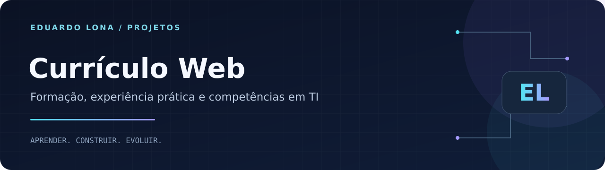

<p align="center"></p>

<p align="center"><strong>HTML · CSS · JavaScript · Apresentação profissional</strong></p>
<p align="center"><a href="#sobre">Sobre</a> · <a href="#como-executar">Como executar</a> · <a href="https://github.com/Dudulonabr">Perfil do autor</a></p>

# Currículo Web — Eduardo Lona

## Sobre

Versão web do meu currículo, desenvolvida para apresentar formação, experiência prática, projetos e competências de maneira clara. Complementa minha candidatura a oportunidades de estágio e posições iniciais em tecnologia.

## Conteúdo e recursos

- Objetivo e resumo profissional.
- Formação em ADS, Engenharia de Software e Técnico em Informática.
- Experiência prática com suporte, hardware e manutenção.
- Projeto Futuro das Cidades e cursos complementares.
- Competências técnicas e comportamentais.
- Certificados em PDF, navegação por seções e elementos interativos.

## Como executar

```bash
git clone https://github.com/Dudulonabr/Curriculo_Eduardo_Lona.git
cd Curriculo_Eduardo_Lona
python -m http.server 8000
```

Abra **http://localhost:8000**. Também é possível abrir `index.html` diretamente no navegador. Não há instalação de dependências ou build obrigatório; fontes externas podem depender de internet.

## Organização

| Caminho | Conteúdo |
| --- | --- |
| `index.html` | Estrutura e informações do currículo |
| `styles.css` | Estilos e adaptação a diferentes telas |
| `script.js` | Interatividade da interface |
| `certificados/` | Certificados disponibilizados em PDF |

## Aprendizados demonstrados

Desenvolvimento de páginas estáticas, organização de informações profissionais, CSS responsivo, navegação e manipulação do DOM com JavaScript.

## Autor

**Eduardo Moreira Monteiro Lona** · São Paulo, Brasil

Estudante de **Análise e Desenvolvimento de Sistemas (UNIP)** e **Engenharia de Software (Cruzeiro do Sul)**, com formação técnica em **Informática pelo SENAC**.

[LinkedIn](https://www.linkedin.com/in/eduardo-moreira-monteiro-lona) · [E-mail](mailto:dudulona07@gmail.com) · [GitHub](https://github.com/Dudulonabr)
